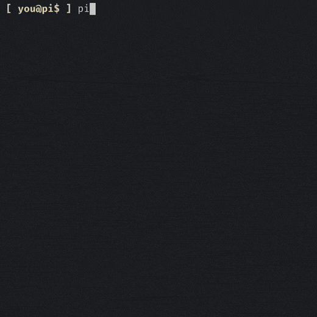

<p align="center">
  
</p>

<p align="center">
  <strong>Limitless research and knowledge store — for pi, agent skill, or SDK.</strong>
</p>

<p align="center">
  <a href="docs/PI-EXTENSION.md">Pi extension</a>
  ·
  <a href="docs/AGENT-SKILL.md">Agent skill</a>
  ·
  <a href="docs/SDK.md">SDK</a>
  ·
  <a href="docs/KNOWLEDGE-STORE.md">Knowledge store</a>
  ·
  <a href="docs/CONFIGURATION.md">Configuration</a>
  ·
  <a href="docs/ARCHITECTURE.md">Architecture</a>
</p>

---

<a href="https://github.com/Lincoln504/pi-research/actions/workflows/ci.yml"></a> <a href="https://www.npmjs.com/package/@lincoln504/pi-research"></a>

Research is broken into subtasks automatically, with each sub-researcher given a high volume of sources to investigate. Then, evaluator decides whether the answer is complete or an additional round of research is needed. The final result is a synthesized cited report.

Ask in natural language — the tool understands the depth needed:



### Use cases

- Plug-and-play (no API key needed) research tool for your [pi](https://github.com/earendil-works/pi).
- Research from Claude Code, Codex, or another coding agent, with a cheaper lightweight or local model driving the research so it doesn't spend your main agent's budget.
- Populating a dataset or building an index of knowledge sources from the web.
- Holding research in the knowledge store with a configurable scope — project-specific or globally user-scoped, set per directory from the `/research-config` TUI.
- Using the pi-research agent skill as OpenClaw's web access.
- Building agent systems that identify and examine web sources.

### Advantages

- Unlimited search and scrape, for free — you only pay for LLM tokens.
- Context-efficient — it returns a synthesized, cited report to the chat instead of dumping raw web content into the conversation.
- Safe by design — web access runs inside a specialized, limited research agent with no filesystem or shell access.
- Search a little or a lot — three depth levels in the pi tool (four via the SDK and standalone CLI, which add the quick depth-0 path). Levels 1 and 2 are recommended for everyday workflow use; level 3 is for larger-scale investigations.

### Requirements / limitations

- Node.js >= 22.19.0
- An LLM with a 100k+ context window (bring your own key)
- Internet access
- A residential IP address — search, scraping, and YouTube transcripts all rely on a residential connection. A datacenter/VPS/cloud IP gets bot-blocked by the providers these features depend on.
- The pi runtime the engine builds on — `@earendil-works/pi-ai`, `@earendil-works/pi-coding-agent`, and `@earendil-works/pi-tui`. The pi extension uses the host's copies; the standalone CLI / agent skill install them as dependencies (`@earendil-works/pi-coding-agent` is the dependency the launcher checks is resolvable, and it will tell you to reinstall if a partial install leaves it out).
- Cloudflare and similar anti-automation systems block scraping on some sites, so runs will identify sources they cannot reach. pi-research compensates with volume: the search tool rapidly pulls a large set of results off free DuckDuckGo, giving the model a wide selection of reachable content to cite.

### Install

Install the front-end you want.

pi extension

```bash
pi install npm:@lincoln504/pi-research
```

Standalone CLI / agent skill

```bash
npm install -g @lincoln504/pi-research
```

Then configure a model and key — set `PI_RESEARCH_MODEL` (e.g. `openai/gpt-4o`) plus `PI_RESEARCH_API_KEY` and `PI_RESEARCH_PROVIDER`, either as environment variables or in `~/.pi/research/config.env`. See [Configuration](docs/CONFIGURATION.md). (The pi extension needs no key — it uses pi's own auth.)

See [Agent skill](docs/AGENT-SKILL.md) for details.

The first install pulls the stealth browser engine, which takes a few minutes.

On Windows, run the CLI from `cmd` or use `pi-research.cmd` — stock PowerShell
execution policy (`Restricted`) blocks npm's `.ps1` shims with a "running
scripts is disabled" error. Alternatively run
`Set-ExecutionPolicy -Scope CurrentUser RemoteSigned` once.

### Stability (v1.x.x)

v0.1.13 (April 2026) was the last release before a rebuild against current pi APIs
and the stealth-browser stack. v1.0.0 is the first stable release since. Channels:

- npm (`npm:@lincoln504/pi-research`) is the stable channel, kept current with breaking pi changes.
- A git install is the development channel: latest commits, first to break.

### License

MIT. Bundled third-party licenses are listed in
[docs/THIRD-PARTY-NOTICES.md](docs/THIRD-PARTY-NOTICES.md).
