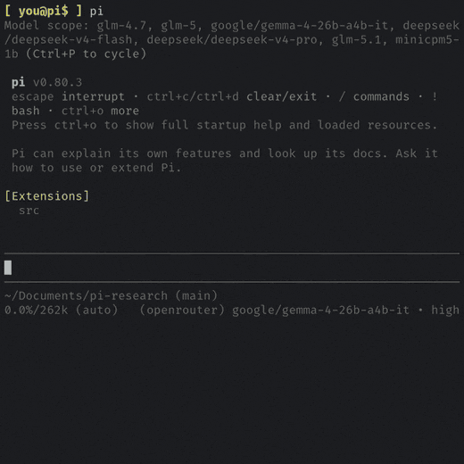
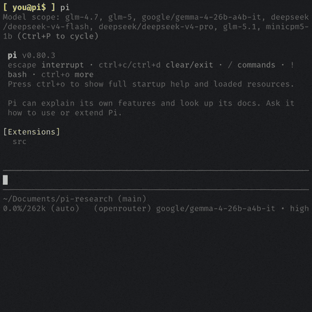

## Agent Skill

pi-research ships as a portable [Agent Skill](https://agentskills.io/specification)
so any skills-compatible coding agent (Claude, OpenAI Codex CLI, OpenClaw, and
others using the same `SKILL.md` directory model) can run web research through the
pi-research software.



### How it works

```
agent
  │  shells out (Bash / exec)
  ▼
run.mjs  —  zero-dep launcher (skills/pi-research/scripts/)
  │  locates the installed engine, or fails fast with guidance
  ▼
pi-research engine  —  the SDK (dist/cli.mjs)
  │  init → run → shutdown
  ▼
cited Markdown report  →  stdout  →  back to the agent
```

The agent matches the `description` in `SKILL.md` and shells out to the launcher.
`run.mjs` carries no dependencies; it locates the installed engine
(`PI_RESEARCH_BIN` pointing at the engine's `dist/cli.mjs`, then
`PI_RESEARCH_PATH` pointing at its package dir, then PATH / `node_modules` /
`~/.pi/bin`) and exits with an actionable
message — including config-file locations — if the package, a model, or an API key
is missing. It exposes four subcommands: `research "<query>"` (live research),
`knowledge "<query>"` (search past findings), `knowledge-config [set <mode>]`
(show/set the per-directory knowledge-store mode), and `status` (inspect detection/config).

### Installation flow

The skill source lives at `skills/pi-research/` inside the package. Installing means
linking that directory into each agent's skills folder.

One-click (recommended). From the `pi` extension, run `/research-config` →
Install in External Agents. The installer:

1. Detects which target agents are present under `$HOME` — currently Claude
   (`~/.claude/skills`), OpenAI Codex CLI (`~/.codex/skills`), and OpenClaw
   (`~/.openclaw/skills`, OpenClaw's managed skill root, which accepts symlinked
   skill folders).
2. Symlinks `skills/pi-research/` into each present agent, never overwriting an
   unrelated skill already in that slot.
3. Records what it created in a manifest, so Remove from External Agents
   removes only its own links. Stale links are also garbage-collected on startup and
   on `npm uninstall`.

**OpenClaw without `pi`**

If you run OpenClaw but not the `pi` extension, register the skill with OpenClaw's
own CLI after installing the engine — OpenClaw copies the `SKILL.md` folder into its
managed skill root and reads it on the next session:

```bash
npm install -g @lincoln504/pi-research
openclaw skills install "$(npm root -g)/@lincoln504/pi-research/skills/pi-research" --global
```

OpenClaw drives the skill through its `exec` tool, gated on `node` being on `PATH`
(`metadata.openclaw.requires.bins`). A bare `openclaw skills install git:…` is *not*
used here: OpenClaw expects `SKILL.md` at a repo root, whereas this package nests it
under `skills/pi-research/` — install the engine from npm and point OpenClaw at that
folder, as above.

Cursor is intentionally excluded from the one-click flow — it has no global skills
directory and reads only project-level `.cursor/skills/`. Link it per project:

```bash
ln -s "$(npm root -g)/@lincoln504/pi-research/skills/pi-research" .cursor/skills/pi-research
```

Manual. Symlink the directory into any agent's skills folder yourself:

| Agent | Personal | Project |
|-------|----------|---------|
| Claude | `~/.claude/skills/pi-research/` | `<project>/.claude/skills/pi-research/` |
| OpenAI Codex CLI | `~/.codex/skills/pi-research/` | `<project>/.codex/skills/pi-research/` |
| OpenClaw | `~/.openclaw/skills/pi-research/` | `<workspace>/skills/pi-research/` |
| Cursor | — (no global dir) | `<project>/.cursor/skills/pi-research/` |

### Prerequisites

- Node.js >= 22.19.0
- `pi-research` installed where the launcher can find it, plus a model + API key.
  See [Configuration](CONFIGURATION.md).

```bash
npm install -g @lincoln504/pi-research
node "<skill_dir>/scripts/run.mjs" status   # verify the engine is detected
```



Once installed, ask the agent to research something — its skill system activates
pi-research automatically. The in-package readme (`skills/pi-research/README.md`) and
`skills/pi-research/references/configuration.md` carry the same detail for anyone
browsing the skill directly.
