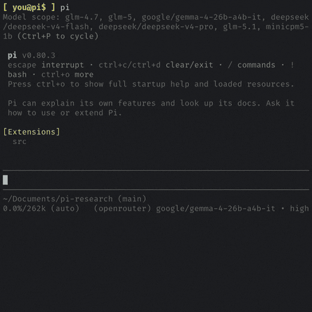

## Configuration

Every front-end (the pi extension, the standalone CLI / agent skill — the surface
OpenClaw and other skills-aware hosts run — and the SDK) shares one configuration
model. This document covers the
settings exposed in the `/research-config` TUI first, then the complete
environment-variable reference, and finally how the configuration layers resolve.



### Settings in the TUI

Run `/research-config` in the pi extension to open an interactive menu. Selecting a
setting and pressing `Enter` / `Space` cycles its value; the change is saved
immediately. A setting is written to one of two scopes:

- `[project]` — saved per working directory in the central project registry, so
  a given repo can carry its own value without changing your global default.
- user — saved to the shared base file (`config.env`), applying to every
  directory and front-end unless a higher layer overrides it.

| Setting | Scope | Values | Env var |
|---------|-------|--------|---------|
| `/research` depth | project | normal · deep · ultra | `PI_RESEARCH_DEFAULT_RESEARCH_DEPTH` |
| Knowledge Mode | project | none · project · global | `PI_RESEARCH_KNOWLEDGE_STORE_MODE` |
| Researcher Timeout | user | 3 · 5 · 10 · 15 · 20 · 30 (minutes) | `PI_RESEARCH_TIMEOUT_MS` |
| Max Concurrency | user | 1 – 5 | `PI_RESEARCH_MAX_RESEARCHERS` |
| Scrape Batches | user | unlimited · 1 · 2 · 3 · 5 · 10 · 15 | `PI_RESEARCH_MAX_SCRAPE_BATCHES` |
| Auto-export Report | user | true · false | `PI_RESEARCH_REPORT_EXPORT_ENABLED` |
| Embedding Model | user | one of the supported models | `PI_RESEARCH_EMBEDDING_MODEL` |
| Embedding Device | user | GPU · CPU | `PI_RESEARCH_EMBEDDING_DEVICE` |
| Cache Retention | user | 7 · 14 · 30 · 60 · 90 · 180 · 365 (days) | `PI_RESEARCH_CACHE_TTL_DAYS` |
| Debug Logging | user | true · false | `PI_RESEARCH_DEBUG` |

Embedding Device offers two choices in the menu. GPU maps to the
auto-detect path: pi-research probes whether WebGPU actually runs on this machine
and falls back to CPU if it does not. CPU forces CPU-only
inference. Raw forced-GPU (no probe) is reachable only through the
`PI_RESEARCH_EMBEDDING_DEVICE=webgpu` environment variable, for benchmarking — see
the [knowledge store doc](KNOWLEDGE-STORE.md).

The Embedding Model, Embedding Device, and Cache Retention rows appear
only when Knowledge Mode is not `none`.

The menu also offers actions that are not settings: Run Diagnostics (health
check), Database Status, Clear Project / User Store, Session Metrics,
Clear Debug Logs, and Install / Remove in External Agents (the coding-agent
skill installer). Browser worker count is deliberately not in the menu — it is
CPU/RAM-sensitive and set only via `PI_RESEARCH_WORKER_THREADS`.

### Environment variables

Every setting is also an environment variable. The repo's
[`.env.example`](https://github.com/Lincoln504/pi-research/blob/main/.env.example)
is the canonical, exhaustive list with inline notes; this section groups the same
variables with their defaults and valid ranges.
Out-of-range numeric values are clamped (with a warning); an invalid enum value
falls back to the default (with a warning).

The TUI-exposed variables are marked `(TUI)`. The `[project]` mark indicates a
project-scoped key (saved per directory in the registry); all others are
user-scoped.

Research

| Variable | Default | Range | Description |
|----------|---------|-------|-------------|
| `PI_RESEARCH_TIMEOUT_MS` (TUI) | `300000` | 180000–1800000 | Per-researcher timeout (3–30 min). |
| `PI_RESEARCH_MAX_RESEARCHERS` (TUI) | `3` | 1–5 | Parallel researchers. |
| `PI_RESEARCH_DEFAULT_RESEARCH_DEPTH` (TUI) `[project]` | `1` | 1–3 | Depth for `/research` and the CLI when `--depth` is omitted (1=normal, 2=deep, 3=ultra). |
| `PI_RESEARCH_MAX_SCRAPE_BATCHES` (TUI) | `2` | 0–99 | Scrape batches per researcher (0 = unlimited). |
| `PI_RESEARCH_MAX_CONCURRENT_SCRAPES` | `3` | 1–20 | Concurrent URLs fetched per scrape batch. |
| `PI_RESEARCH_MAX_RETRIES` | `2` | 0–5 | Retries per researcher request. |
| `PI_RESEARCH_RETRY_DELAY_MS` | `2000` | 100–10000 | Base delay between retries. |
| `PI_RESEARCH_WORKER_THREADS` | `4` | 1–10 | Browser worker processes. Higher = more throughput, more CPU/RAM. |
| `PI_RESEARCH_WORKER_CONCURRENCY` | `2` | 1–10 | Tasks per worker process. |
| `PI_RESEARCH_MODEL` | _(session model)_ | — | Model override for researcher sub-agents (deep and quick) and knowledge synthesis. The coordinator and evaluator keep using the session model. Accepts `provider/id` or a bare model id. |
| `PI_RESEARCH_DISABLED_TOOLS` | _(none)_ | — | Comma-separated research tools to disable for a run (`search`, `scrape`, `security_search`, `stackexchange`, `youtube_transcript`, `grep`). Removed from every researcher's toolset and named in the coordinator/evaluator prompt. |
| `PI_RESEARCH_REPORT_EXPORT_ENABLED` (TUI) | `false` | — | Front-ends write a Markdown report to disk and surface its path. |
| `PI_RESEARCH_REPORT_EXPORT_DIR` | _(smart cwd)_ | — | Pin exported reports to a fixed directory, bypassing the cwd-relative resolution. Useful for the agent skill, which runs from the host agent's arbitrary directory. |
| `PI_RESEARCH_MAX_SCRAPE_TOKEN_FRACTION_FOR_SCRAPING` | `0.15` | 0.05–1.0 | Max fraction of the context window used for initial scrape context. |
| `PI_RESEARCH_AVG_TOKENS_PER_SCRAPE` | `2500` | 500–10000 | Estimated tokens per scrape result, used for planning. |

YouTube transcripts

| Variable | Default | Range | Description |
|----------|---------|-------|-------------|
| `PI_RESEARCH_YOUTUBE_TRANSCRIPT_MAX_VIDEOS` | `3` | 1–5 | Videos transcribed per `youtube_transcript` call. |
| `PI_RESEARCH_YOUTUBE_TRANSCRIPT_TIMEOUT_MS` | `20000` | 5000–120000 | Per-video transcript timeout. |
| `PI_RESEARCH_YOUTUBE_TRANSCRIPT_LANG` | `en` | — | Preferred caption language (BCP-47 prefix). |
| `PI_RESEARCH_YOUTUBE_QUERY_EVERY_N` | `5` | 1–100 | Append `youtube` to roughly one-in-N search queries (1 = every query). |
| `PI_RESEARCH_YOUTUBE_POTOKEN_REQUEST_KEY` | _(built-in)_ | — | Advanced: override the BotGuard PoToken web request key (only if YouTube rotates the public key and transcripts start failing). |

Timeouts

| Variable | Default | Range | Description |
|----------|---------|-------|-------------|
| `PI_RESEARCH_LLM_TIMEOUT_MS` | `300000` | 60000–600000 | Coordinator / evaluator / repair / knowledge LLM call timeout. |
| `PI_RESEARCH_SCRAPE_TIMEOUT_MS` | `15000` | 5000–120000 | Per-page scrape (page-load) timeout. |
| `PI_RESEARCH_SEARCH_TIMEOUT_MS` | `45000` | 5000–120000 | Browser search page timeout. |
| `PI_RESEARCH_BROWSER_TASK_TIMEOUT_MS` | `10000` | 2000–120000 | Queue-wait / overhead margin added to each browser op's own timeout (a search task ceiling is `SEARCH_TIMEOUT_MS` + this; a scrape is `SCRAPE_TIMEOUT_MS` + this). |
| `PI_RESEARCH_HEALTH_CHECK_TIMEOUT_MS` | `10000` | 2000–120000 | Pre-flight health-check timeout. |

LLM output & reasoning

These are advanced, env-only knobs (not in the TUI).

| Variable | Default | Range | Description |
|----------|---------|-------|-------------|
| `PI_RESEARCH_LLM_THINKING_LEVEL` | `off` | off · minimal · low · medium · high | Chain-of-thought level for all engine LLM work (coordinator, evaluator, synthesis, JSON-repair, knowledge extraction, and researcher sub-agents). Off by default — these calls emit structured JSON / cited reports, so a thinking block only consumes the output budget and can truncate the answer. Clamped per model by pi. |
| `PI_RESEARCH_PLANNING_MAX_TOKENS` | `16384` | 1024–131072 | Max output tokens for the plan + mid-round evaluator decision. Clamped to the model's real ceiling. |
| `PI_RESEARCH_SYNTHESIS_MAX_TOKENS` | `32768` | 1024–131072 | Max output tokens for the final synthesized report. Clamped to the model's real ceiling. |

Knowledge store

See the [knowledge store doc](KNOWLEDGE-STORE.md) for what each value does.

| Variable | Default | Range | Description |
|----------|---------|-------|-------------|
| `PI_RESEARCH_KNOWLEDGE_STORE_MODE` (TUI) `[project]` | `global` | none · project · global | Store scope: one shared store across every directory (`global`), scoped to the current directory (`project`), or disabled (`none`). |
| `PI_RESEARCH_EMBEDDING_MODEL` (TUI) | `onnx-community/granite-embedding-small-english-r2-ONNX` | — | Embedding model. Changing it clears the store and starts fresh. |
| `PI_RESEARCH_EMBEDDING_DEVICE` (TUI) | `auto` | auto · webgpu · cpu | Inference backend. `auto` probes WebGPU viability out-of-process and falls back to CPU; `cpu` forces CPU; `webgpu` forces the GPU path with no probe (advanced — can hard-crash on a software GPU). The TUI exposes only `auto` (as "GPU") and `cpu`. |
| `PI_RESEARCH_CACHE_TTL_DAYS` (TUI) | `30` | 1–365 | How long cached findings are kept before eviction. |
| `PI_RESEARCH_MIGRATION_STRATEGY` | `backup` | drop · backup · re-embed | What to do with stored data when the embedding model changes. |
| `PI_RESEARCH_KNOWLEDGE_DIR` | _(auto)_ | — | Override the knowledge-store database directory. Default: `~/.pi/research/knowledge_db`. |
| `PI_RESEARCH_EMBEDDING_MODEL_INIT_TIMEOUT_MS` | `300000` | 10000–600000 | Embedding-model initialization timeout (first-time download can be slow). |
| `PI_RESEARCH_WEBGPU_REPROBE` | _(unset)_ | — | Set `1` to discard the cached WebGPU-viability verdict and probe again on next use. |

API keys (all optional)

| Variable | Description |
|----------|-------------|
| `PI_RESEARCH_API_KEY` / `PI_RESEARCH_PROVIDER` | Explicit LLM credentials for SDK / CLI mode (not needed when using pi's own auth). Provider is required alongside the key. |
| `STACKEXCHANGE_API_KEY` | Raises the Stack Exchange tool's limit from 300/day to 10,000/day. Obtain at <https://stackapps.com/apps/oauth>. |
| `GITHUB_TOKEN` | Raises the security tool's GitHub Advisory limit from 60/hr to 5000/hr (any default-scope token). |
| `NVD_API_KEY` | Raises the security tool's NVD limit ~10× and tightens request spacing. Request at <https://nvd.nist.gov/developers/request-an-api-key>. |

Diagnostics & platform

| Variable | Default | Description |
|----------|---------|-------------|
| `PI_RESEARCH_DEBUG` (TUI) | `false` | Verbose INFO+DEBUG logging to the log file. |
| `PI_RESEARCH_CONSOLE_LOG` | `false` | Mirror logs to stdout/stderr (useful in CI / headless). |
| `PI_RESEARCH_LOG_PATH` | _(OS temp)_ | Override the verbose log file path. Browser workers inherit it automatically. |
| `PI_RESEARCH_LOG_FILE` | _(unset)_ | Send browser worker-thread logs to a separate file. If unset, workers log to `PI_RESEARCH_LOG_PATH`. |
| `PI_RESEARCH_TMP_DIR` | `~/.cache/pi-research/profiles` | Transient per-worker browser-profile directory. Disk-backed by default (kept off a RAM-backed `/tmp` so per-worker profiles don't add memory pressure). Point under the system temp dir to opt into tmpfs/RAM. |
| `PI_RESEARCH_STATE_DIR` | `~/.pi/research/state` | Override the state directory (active sessions, browser status, project registry). |
| `PI_RESEARCH_TUI_REFRESH_DEBOUNCE_MS` | `100` | TUI refresh debounce (0–1000 ms). |
| `PI_RESEARCH_SKIP_HEALTHCHECK` | _(unset)_ | Set `1`/`true` to skip the pre-flight browser/embedding health check and rely on per-task timeouts. |
| `PI_RESEARCH_USE_XVFB` | _(unset)_ | Linux only. Bare-TTY runs are true-headless and need no X server; set `true` to opt into a virtual framebuffer (`sudo apt install xvfb`). |
| `PI_RESEARCH_SKILL_DIR` | _(auto)_ | Override the bundled research-skill source directory used by the skill installer. |
| `PI_RESEARCH_CONFIG_DIR_NAME` | `.pi` | Override the host config-directory name under your home dir (advanced; e.g. set to share another harness's config root). |

Testing only — never enable in production

| Variable | Description |
|----------|-------------|
| `PI_RESEARCH_MOCK_SEARCH` | Return fabricated search results instead of real web data. |
| `PI_RESEARCH_MOCK_SCRAPE` | Return fabricated scrape results instead of real page content. |
| `PI_RESEARCH_FORCE_READY` | Bypass readiness checks and run even when critical services failed to initialize. |
| `PI_RESEARCH_ALLOW_LOOPBACK_SCRAPE` | Permit scraping loopback/private/internal addresses, bypassing SSRF protection. |

### How configuration is layered

Configuration resolves from the following layers, lowest to highest precedence
(later wins):

```
built-in defaults
  < ~/.pi/research/config.env                       (base, shared; edited by /research-config)
  < ~/.pi/research/{pi,cli}.env                      (optional per-front-end overlay)
  < legacy .pi-research.env in the cwd               (deprecated; auto-migrated to the registry)
  < project registry                                 (~/.pi/research/state/project-settings.json, per directory)
  < process.env                                      (real shell env always wins)
```

Base file. `config.env` holds your shared, user-scoped settings. The
`/research-config` TUI edits only this file (and the project registry) — never the
overlays or the merged view — so overlay values are never baked back into the base.

Per-front-end overlays. Each front-end reads only its own optional overlay,
layered over the shared base, so they can be configured independently. Exactly two
exist:

- `~/.pi/research/pi.env` — the pi extension
- `~/.pi/research/cli.env` — the standalone CLI / agent skill (the surface OpenClaw
  and other skills-aware hosts run)

The overlay files do not exist by default; create the one you need by hand. There is
intentionally no `sdk.env`: the SDK is a library configured from code (see
[SDK.md](SDK.md)), not from a global file.

Example — give the standalone CLI / agent skill its own model and depth without
touching the pi extension:

```sh
# ~/.pi/research/config.env   (shared baseline)
PI_RESEARCH_KNOWLEDGE_STORE_MODE=project

# ~/.pi/research/cli.env       (standalone CLI / agent skill only)
PI_RESEARCH_MODEL=openrouter/anthropic/claude-sonnet-4-6
PI_RESEARCH_DEFAULT_RESEARCH_DEPTH=2
```

Project registry. Project-scoped settings (research depth and knowledge-store
mode) are stored per directory in `project-settings.json`, keyed by normalized
working-directory path. They override the base and overlays for that directory only.
In the pi extension the `/research-config` TUI writes them. On the standalone CLI you can
set the knowledge-store mode per directory directly:

```sh
pi-research knowledge-config                       # show the mode here and where it comes from
pi-research knowledge-config set none|project|global
```

Under the agent skill you don't have to run this yourself — you ask the agent (e.g. "disable the
knowledge store here" / "make it project-scoped") and it runs the same command on your
behalf. Either way it lands in the registry (above `config.env` in precedence), so a
per-directory value overrides a machine-wide `config.env` default; a real environment
variable still outranks both.

process.env. A real environment variable always wins. For a one-off override,
just export the variable for that process.

> The base file is not loaded automatically by your shell. Either use the
> `/research-config` TUI (which writes it), export variables in your shell, or use a
> loader such as direnv. `.env.example` is a reference, not an active config file.

### Where files live

All pi-research state lives under its own namespace, `~/.pi/research/`:

| Path | Contents |
|------|----------|
| `~/.pi/research/config.env` | Shared base configuration (user-scoped settings). |
| `~/.pi/research/{pi,cli}.env` | Optional per-front-end overlays. |
| `~/.pi/research/state/project-settings.json` | Project registry (per-directory settings). |
| `~/.pi/research/state/` | Active sessions, browser status, locks. |
| `~/.pi/research/knowledge_db/` | The knowledge store (LanceDB), unless `PI_RESEARCH_KNOWLEDGE_DIR` is set. |
| `~/.cache/pi-research/profiles/` | Transient browser profiles, unless `PI_RESEARCH_TMP_DIR` is set. |
| `~/.cache/pi-research/webgpu-viability.json` | Cached WebGPU-viability verdict (see the knowledge store doc). |

Paths can be relocated with `PI_RESEARCH_STATE_DIR`, `PI_RESEARCH_KNOWLEDGE_DIR`,
and `PI_RESEARCH_TMP_DIR`.
