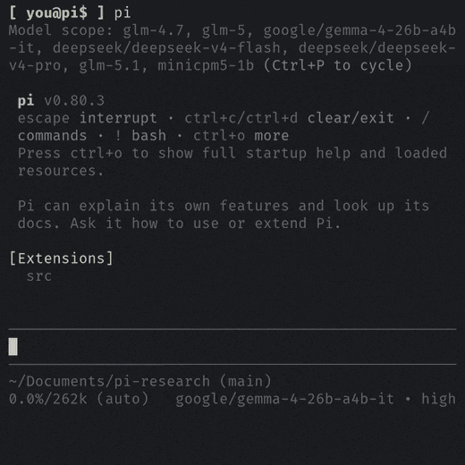

## Pi Extension

pi-research integrates as a [pi](https://github.com/badlogic/pi-mono)
extension (`src/index.ts`) — a multi-agent web research engine with a real-time
TUI, registered directly in the pi process.

### Usage

The `research` tool is auto-registered, so the model invokes it
from natural language, and the tool understands the depth needed (1–3) from the query.

```bash
pi -p "research the latest developments in WebAssembly"
pi -p "do a thorough deep-dive on the AI inference hardware landscape"
```

Three slash commands are also registered:

| Command | Description |
|---------|-------------|
| `/research <query>` | Invokes the `research` tool directly at the configured default depth (`PI_RESEARCH_DEFAULT_RESEARCH_DEPTH`, 1 by default) — a plain live run with no LLM turn. It does not parse an inline depth and does **not** consult the knowledge store; use `/knowledge-store <query>` for a store-only lookup. (The knowledge store is only checked when the *agent* chooses to call `research_knowledge_search` during a normal turn, which is prompt-guided, not a gate in front of `research`.) |
| `/research-config` | Opens the interactive TUI settings dashboard. |
| `/knowledge-store <query>` | Searches the local knowledge store for a query and returns a synthesised answer from previously researched findings. Unavailable when Knowledge Mode is `none`. The store auto-manages its own compaction, so there is no maintenance subcommand. |



### Tools

The extension registers three tools:

| Tool | Registered |
|------|-----------|
| `research` | always |
| `health` | always |
| `research_knowledge_search` | always (see note) |

`research_knowledge_search` is registered unconditionally so a Knowledge Mode
change takes effect without restarting pi (pi has no unregister API). When
`PI_RESEARCH_KNOWLEDGE_STORE_MODE` is `none` the tool is not advertised to the
agent — its prompt guidance is stripped, and any call returns a "store disabled"
result; the `/knowledge-store` command is likewise unavailable. Advertisement and
the store's read/write paths are gated on the live mode, not on this registration.

Tool exclusion — the `research` tool honors an `excludeTools` list taken from
the pi session context when the host forwards one.

### TUI

During a run pi-research renders a live progress panel:

- Researcher slices — one per agent: status, URLs scraped, actions taken.
- Wave animation — active-crawl indicator.
- Token usage — model tokens + estimated cost (non-decreasing guard).
- Status flashes — green on success, red on failure.
- Steering messages — queued and active mid-run user guidance.

| Key | Action |
|-----|--------|
| `Escape` | Cancel active research |
| Arrow keys | Navigate the `/research-config` menu |
| `Enter` / `Space` | Cycle a setting's value |

### Configuration

Manage settings through `/research-config`, which edits two layers:

- Global — base `~/.pi/research/config.env` (applies to all front-ends).
- Project — the centralized registry (`~/.pi/research/state/project-settings.json`),
  scoped per working directory. Only depth and knowledge-store mode are
  project-scoped, so a given repo can carry its own research depth without
  changing your global default.

To configure the pi extension independently of the other front-ends, add an
optional overlay at `~/.pi/research/pi.env` (it layers over `config.env` for the
pi extension only). The full configuration model, precedence, and the complete
environment-variable list live in [CONFIGURATION.md](CONFIGURATION.md).

### Coding-agent skill installer

The `/research-config` menu can install the `pi-research` skill into your other
coding agents (Claude, Codex, OpenClaw) so they can run web research through the
CLI, and remove it again — with exact, manifest-tracked cleanup. See
[AGENT-SKILL.md](AGENT-SKILL.md) for the full installation flow.

### Lifecycle

- `activate` — registers commands, tools, the TUI controller, and initializes services.
- `deactivate` — drains the writer queue, closes LanceDB, terminates the browser pool, disposes the embedding model.
- `session_shutdown` — branches on `event.reason`: a `quit` triggers process-exit cleanup; reload / new / resume / fork clean up without exiting.

Extension state is isolated per pi session, so `/reload` is safe.
